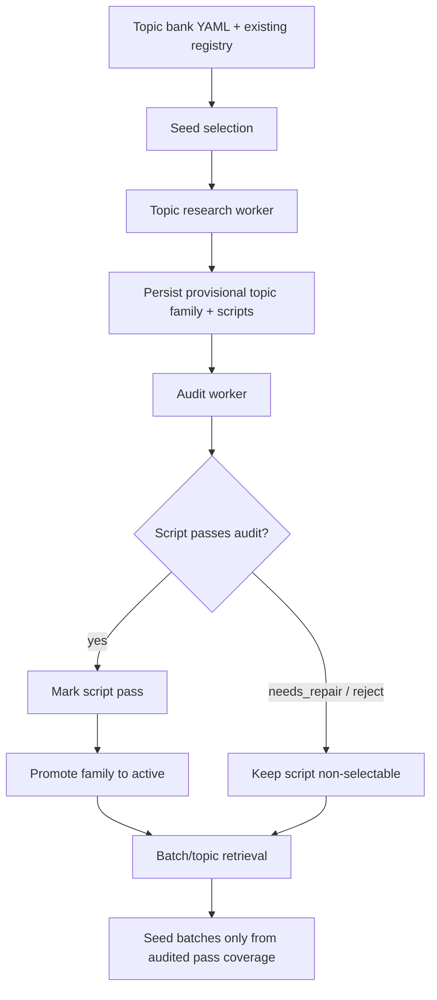

# Topic System Flow Reference

Current behavior for research, topic retrieval, audit, and script writing.

## High-Level Flow

## What Happens In Practice

### 1. Seed selection
- The topic researcher starts from the YAML topic bank.
- `pick_topic_bank_topics(...)` prefers:
  - unused topics first
  - lower `use_count`
  - older `last_used_at`
  - older `last_harvested_at`
- One run excludes topics already chosen earlier in that same run.

### 2. Research
- `workers/topic_researcher.py` selects a seed topic.
- It runs the shared warmup/research path for that seed.
- The research stage writes candidate families and scripts into the database.
- The run is recorded in `topic_research_runs`.

### 3. Persistence
- Research output is stored as topic families and script variants.
- New families are initially `provisional`.
- New script variants are stored as `pending` until they are audited.
- This is the point where data enters the bank, but it is not yet selectable.

### 4. Shared pre-persistence gate
- Every topic-writing path now calls the same deterministic gate before insert/update:
  - research worker output
  - manual hub persistence
  - variant expansion
  - generic `topic_scripts` upserts
- The gate strips dash separators, normalizes time references to the current 2026 context, keeps 8s scripts in the 14-18 word range, and preserves titles/topics as plain metadata instead of sentence-like prose.

### 5. Audit
- The audit agent is **not** used to choose seeds during batch retrieval.
- The audit agent is used **after persistence**.
- `workers/audit_worker.py` reads `topic_scripts` rows where `audit_status='pending'`.
- `app/features/topics/audit.py` applies deterministic checks first, then Gemini-based audit scoring.
- Audit results write back:
  - `pass`
  - `needs_repair`
  - `reject`

### 6. Promotion
- `update_script_quality(...)` writes the audit result to the script row.
- If any script in a family passes, the family is promoted from `provisional` to `active`.
- Rejected or repair-needed scripts stay non-selectable.

### 7. Topic retrieval / batch seeding
- Batch creation does **not** run audit inline.
- It reads only audited family coverage.
- If coverage is short, the batch returns `coverage_pending`.
- The batch scheduler/handler queues warmup and audit promotion in the background.
- Selection only reuses `audit_status='pass'` coverage and only if `use_count == 0`; once a script has been used for a post it is one-and-done, and any future reuse must come from a fresh variant in the same family.

### 8. Script writing
- Script generation happens during research.
- A script candidate is written, then validated by deterministic checks.
- If the draft fails structural checks, it is rewritten or synthesized before persistence.
- The stored script still enters the audit queue as `pending`.

## Current Contract

- Research creates candidates.
- Persistence stores provisional families and pending scripts.
- Audit promotes scripts after persistence.
- Retrieval consumes only `pass` coverage.
- Used scripts are never selected again for another post; family reuse is allowed only through fresh unused variants.
- No batch path should depend on a live audit loop.

## Where To Look In Code

- Seed selection: [`app/features/topics/prompts.py`](/Users/camiloecheverri/Documents/AI/AIUGC/AIUGC/app/features/topics/prompts.py)
- Research orchestration: [`workers/topic_researcher.py`](/Users/camiloecheverri/Documents/AI/AIUGC/AIUGC/workers/topic_researcher.py)
- Audit worker: [`workers/audit_worker.py`](/Users/camiloecheverri/Documents/AI/AIUGC/AIUGC/workers/audit_worker.py)
- Audit logic: [`app/features/topics/audit.py`](/Users/camiloecheverri/Documents/AI/AIUGC/AIUGC/app/features/topics/audit.py)
- Audit persistence and family promotion: [`app/features/topics/queries.py`](/Users/camiloecheverri/Documents/AI/AIUGC/AIUGC/app/features/topics/queries.py)
- Batch coverage gating: [`app/features/topics/handlers.py`](/Users/camiloecheverri/Documents/AI/AIUGC/AIUGC/app/features/topics/handlers.py)

## Practical Summary

The audit agent is used after research persistence, not during topic retrieval.
Batch seeding reuses already-audited coverage.
Script writing happens during research, but the script still goes through the pending -> audit -> pass path before reuse.

## Live Validation Snapshot

Tested on 2026-04-02 by forcing one worker-driven deep-research run and then running the audit worker against the same live Supabase project.

- Before:
  - `topic_registry` rows: `58`
  - `pending topic_scripts`: `0`
  - selectable `value` `8s` families: `30`
- Discovery:
  - one new research run completed for `Steuerliche Vorteile: Behinderten-Pauschbetrag, außergewöhnliche Belastungen, Fahrtkosten.`
  - the worker stored one new family: `Gute Terminwege barrierefreie Arzttermine Alltag Praxis Rückruf Support`
- Audit:
  - the pending script was audited immediately afterward
  - audit result: `reject` with score `21`
  - the new family remained `quarantined`
- After:
  - `topic_registry` rows: `59`
  - `pending topic_scripts`: `0`
  - selectable `value` `8s` families: `30`

Takeaway:
- the worker path is actively writing new families
- the shared gate is stripping and normalizing text before persistence
- the audit worker still controls final promotion, so weak drafts can be quarantined without becoming selectable

## Audit JSON Handling

- The audit worker now asks Gemini for structured JSON first.
- If the structured call fails, it retries once with a text-repair prompt.
- A `parse_error` should now be treated as a last-resort failure, not the normal path.
- The `topic_scripts` audit history still records rejects, but malformed JSON should now be much rarer after the structured-first change.
