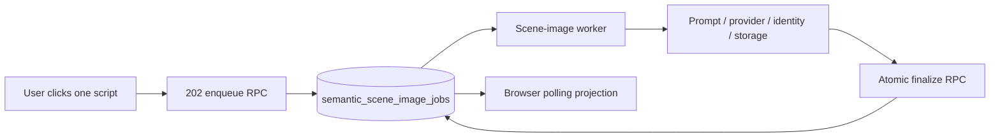

# Semantic scene-image reliability handoff

**Date:** 2026-08-05  
**Production commit:** `47d2f4e1adfdc81fef555900e923ca4d3593a36e`  
**Incident batch:** [38a46595-18db-4346-a4e2-e30e327ba0f2](https://lippelift.xyz/batches/38a46595-18db-4346-a4e2-e30e327ba0f2)

## Outcome

Semantic scene preparation now generates one durable script image per script. The operation is queued in PostgreSQL, processed by a dedicated worker, and projected back into the browser through polling. A user can start only one image operation per batch at a time; sibling controls remain disabled until the complete operation settles.

The production incident was reproduced and resolved on the affected batch. The previously missing third image completed in 36.7 seconds with one provider attempt. The image loaded at 1536×2752, passed identity review evidence, and the card returned to `Ready for identity review`.

## What was broken

The old path combined browser-local loading state with direct candidate-generation RPCs. Several independent failures could therefore produce the same visible symptom: an image card that stayed in `Generating` forever.

1. The browser posted an initial progress revision before a run existed. The old SQL contract rejected that state, leaving the client without a valid durable progress record.
2. The JavaScript action flag was scoped inside the success path and referenced from the error path. A failure raised a second `ReferenceError`, so the button cleanup and visible error message never ran.
3. Candidate creation, provider generation, identity evaluation, object storage, and run finalization were not one durable state machine. Lost acknowledgements or transient reads could make the browser retry an operation whose provider work had already happened.
4. Long provider calls exceeded the effective reservation window. A worker could lose ownership while still generating, or a stale worker could finalize a newer run.
5. Completion was not atomically reconciled with the queue job. A completed image could remain projected as `not started`, while an older run could win the browser's reload race.
6. The earlier stress check used in-memory sleeps rather than PostgreSQL, real leases, storage reconciliation, or the deployed worker. It did not exercise the failure boundaries that caused the incident.

## Architecture now in production

The durable contract is:

- One active image job per batch.
- One standalone provider request and one candidate per script.
- PostgreSQL owns status, run ID, revision, reservation token, deadline, heartbeat, attempt counts, and terminal error.
- The web request returns `202` immediately. Before a job exists, progress is a valid idle response rather than a `404`.
- The dedicated worker processes at most two scripts concurrently and uses a fair run-keyed traffic gate with spaced starts, bounded backoff, jittered provider cooldowns, and a provider attempt cap.
- Every lease has a heartbeat and a bounded deadline. Paid provider admission requires enough remaining lease time for the provider timeout plus a safety window.
- The image payload is checkpointed before upload. A lost upload acknowledgement resumes the same content-hashed object; it never renders a duplicate image.
- Transient checkpoint-read failures preserve durable evidence and fail explicitly without rerendering. A definitive missing object is reported separately.
- Run finalization and job completion are committed atomically and fenced by run ID, revision, and reservation token.
- A historical failed run cannot override a newer active run. Browser reload occurs only after the complete in-flight group settles.
- Terminal failures are explicit and retryable. There is no hidden browser retry.

The migration permanently fences the retired direct candidate reserve/finalize functions. The v1 worker cannot mutate the new queue contract after cutover.

## Browser behavior

The Scene step now treats generation as a batch-level critical section:

1. The clicked button changes to `Generating script image…`.
2. Every sibling generation button is disabled immediately.
3. The browser polls the persisted job and run state.
4. Completion restores all controls and displays the image and identity evidence.
5. Failure restores all controls and displays an exact retry action.
6. A second click while the first operation is active cannot create another job.

This prevents the first finished sibling, an old ready run, or a cancelled browser request from hiding later work.

## Deployment and database cutover

The release was applied migration-first:

1. Applied `supabase/migrations/20260805000000_semantic_scene_image_state_machine.sql` in production.
2. Verified the migration record, required columns, required RPCs, queue contract `semantic-scene-image-v2`, and the legacy direct-generation fence.
3. Deployed commit `47d2f4e1adfdc81fef555900e923ca4d3593a36e` to `main`.
4. The deployment workflow now parses `/livez` and `/health` JSON, checks the dedicated worker heartbeat, and probes the queue before declaring success.
5. Production reported a live application, healthy database, and healthy semantic scene-image worker.

Deployment run: [GitHub Actions 30988338348](https://github.com/patabrava/AIUGC/actions/runs/30988338348).

## Validation evidence

Focused validation completed with:

- `405 passed, 1 skipped` for the affected application and contract suite.
- Real PostgreSQL migration and worker stress test: `2 passed in 16.22s`.
- Ten variable batch runs with script counts `3, 4, 5, 6, 7, 1, 2, 3, 7, 4`.
- 42 total jobs completed with no queued or processing leftovers.
- Worker service-level concurrency remained at or below two, and each script was processed exactly once.
- Deployment contract audit: 17/17 passed.
- Worker readiness audit: 5/5 passed.
- `git diff --check`, compile checks, and the independent release audit passed.

The in-app Browser was used in a separate diagnostic tab to verify the live incident batch. The unique third-script action was clicked, sibling controls were observed disabled during processing, and the completed image was verified in the DOM with no functional console or network errors. The only console output was the pre-existing Tailwind CDN production warning.

## Operator test procedure

Use the [live batch](https://lippelift.xyz/batches/38a46595-18db-4346-a4e2-e30e327ba0f2) and open the Scene step.

1. Click `Regenerate script image` on one script.
2. Confirm all sibling generation buttons are disabled.
3. Wait for `Ready for identity review` or an explicit retryable failure.
4. Confirm the image is visible and the controls are enabled again.
5. Run the next script only after the first operation settles.
6. Check [production health](https://lippelift.xyz/health) if the UI does not update.

The successful live proof completed in 36.7 seconds. The system has a bounded execution deadline and reports a retryable terminal state when provider or infrastructure work cannot finish; it no longer leaves an unbounded spinner.

## Files and durable memory

The implementation spans the queue migration, semantic-video handlers and queries, the dedicated worker, storage and Vertex adapters, browser projection, templates, deployment readiness checks, and regression tests. The repository correction memory in `AGENTS.md` now records the durable queue, one-image-per-script, concurrency, idempotency, lease, migration-fence, and ten-run validation requirements so future changes cannot silently reintroduce the retired path.

Unrelated local analysis and generated output files were intentionally preserved and were not included in the release commit.

