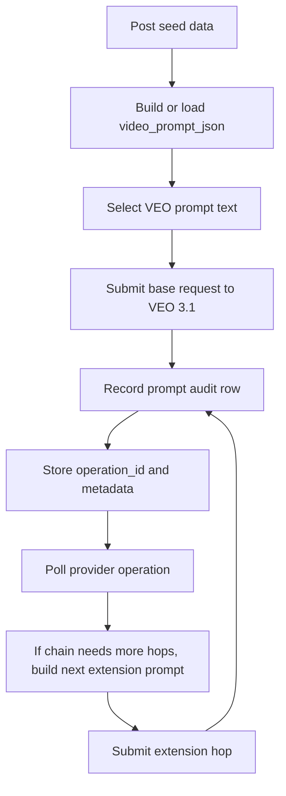

# How VEO Prompt Delivery Works

This document explains the exact flow the app uses to build, send, extend, and audit prompts for VEO 3.1.

## Mental Model

The system has four layers:

1. Seed data from the post.
2. A canonical prompt object stored in `video_prompt_json`.
3. Provider-specific text for the base request and later extension hops.
4. An audit trail that records the exact prompt text sent to VEO.

## End-to-End Flow

## 1. Build The Canonical Prompt

The app first makes sure the post has `video_prompt_json`.

- If `video_prompt_json` already exists, it is reused.
- If it is missing, the app rebuilds it from `seed_data`.
- If `seed_data` is also missing, submission fails.

The builder lives in [app/features/posts/prompt_builder.py](/Users/camiloecheverri/Documents/AI/AIUGC/AIUGC/app/features/posts/prompt_builder.py).

The prompt is assembled from fixed sections:

- `Character`
- `Style`
- `Action`
- `Scene`
- `Cinematography`
- `Dialogue`
- `Ending`
- `Audio`
- `Negative constraints`

For VEO, the important outputs are:

- `optimized_prompt`
- `veo_prompt`
- `veo_negative_prompt`

## 2. Choose The Exact Prompt Text For VEO

When a request is sent, the app chooses prompt text in this order:

1. `veo_prompt`
2. `optimized_prompt`
3. reconstructed full prompt text fallback

That selection happens in [app/features/videos/handlers.py](/Users/camiloecheverri/Documents/AI/AIUGC/AIUGC/app/features/videos/handlers.py).

For VEO, the app also sends `veo_negative_prompt` separately as the REST `negativePrompt` field instead of embedding all negatives inline.

## 3. Submit The Base Request

The base request is sent through `_submit_video_request(...)`.

The payload includes:

- `prompt`
- `negative_prompt`
- `aspect_ratio`
- `resolution`
- `duration_seconds`
- `first_frame_image` only if the anchor feature is enabled
- `seed` only for supported VEO routes

For the current live setup:

- first-frame/image-to-video anchoring is disabled
- the live VEO submission path is text-only

The base request is recorded immediately after a successful submission.

## 4. Record The Prompt Audit

Every submitted prompt is written to `video_prompt_audit`.

The audit row stores:

- `post_id`
- `batch_id`
- `operation_id`
- `provider`
- `prompt_text`
- `negative_prompt`
- `prompt_path`
- `aspect_ratio`
- `resolution`
- `requested_seconds`
- `correlation_id`
- optional `seed`

The audit helper lives in [app/features/videos/prompt_audit.py](/Users/camiloecheverri/Documents/AI/AIUGC/AIUGC/app/features/videos/prompt_audit.py).

This is the best source for the exact text that actually left the app.

## 5. Persist Submission Metadata

After the base request is accepted, the post is updated with:

- `video_operation_id`
- `video_status`
- `video_metadata`

That metadata keeps the chain state, operation IDs, route info, durations, and segment tracking.

## 6. Poll The Provider

The worker in [workers/video_poller.py](/Users/camiloecheverri/Documents/AI/AIUGC/AIUGC/workers/video_poller.py) polls the operation returned by VEO.

When the provider reports progress, the worker updates the post state.

If the chain needs more extension hops, the worker:

1. Reads the stored `video_prompt_json`
2. Reads the stored segment metadata from `video_metadata.veo_segments`
3. Builds the next hop prompt with `build_veo_prompt_segment(...)`
4. Sends the extension request using the previous video URI
5. Records another prompt audit row

## 7. How Extension Hops Are Built

Extension hop prompts are deliberately slimmer than the base prompt.

The worker uses:

- the same stable character and scene identity
- the current dialogue segment
- a hop-specific ending directive
- a hop-specific audio block

The extension builder:

- keeps the prompt text focused on the current segment
- avoids repeating the entire script on every hop
- uses the final ending directive only on the final hop

This logic lives in `_build_veo_extension_prompt(...)` and `_submit_extension_hop(...)` in [workers/video_poller.py](/Users/camiloecheverri/Documents/AI/AIUGC/AIUGC/workers/video_poller.py).

## 8. Why The Final Run Worked Better

The successful run worked better because:

- the prompt was slimmer
- the character identity was stable
- each hop only carried the current dialogue segment
- the ending instruction changed between continuation hops and final hops
- the worker reused the persisted segment list instead of re-splitting the whole script

In practice, this means:

- base hop = full prompt setup
- extension hops = smaller delta prompts
- final hop = same structure, but with an explicit stop-speech ending

## 9. What Gets Logged

The app logs these important events:

- `video_prompt_assembled`
- `video_prompt_backfilled_for_submission`
- `prompt_audit_recorded`
- `video_generation_submitted`
- `extension_hop_submitted`
- `extension_hop_quota_controls_bypassed` when bypass mode is active

Those logs are what you use to reconstruct the exact path after the fact.

## 10. Practical Rule Of Thumb

If you want to predict what VEO receives, check these in order:

1. `video_prompt_json` on the post
2. `veo_prompt` inside that object
3. `veo_negative_prompt`
4. the prompt audit row for the operation ID
5. the worker log entry for the extension hop

## 11. Short Version

The app does not send one giant prompt forever.

- It builds one canonical prompt object.
- It sends the base VEO prompt from that object.
- It stores the exact prompt in the audit table.
- It then sends smaller extension prompts for each hop using the persisted dialogue segments.
- Each hop gets its own operation ID and audit record.

